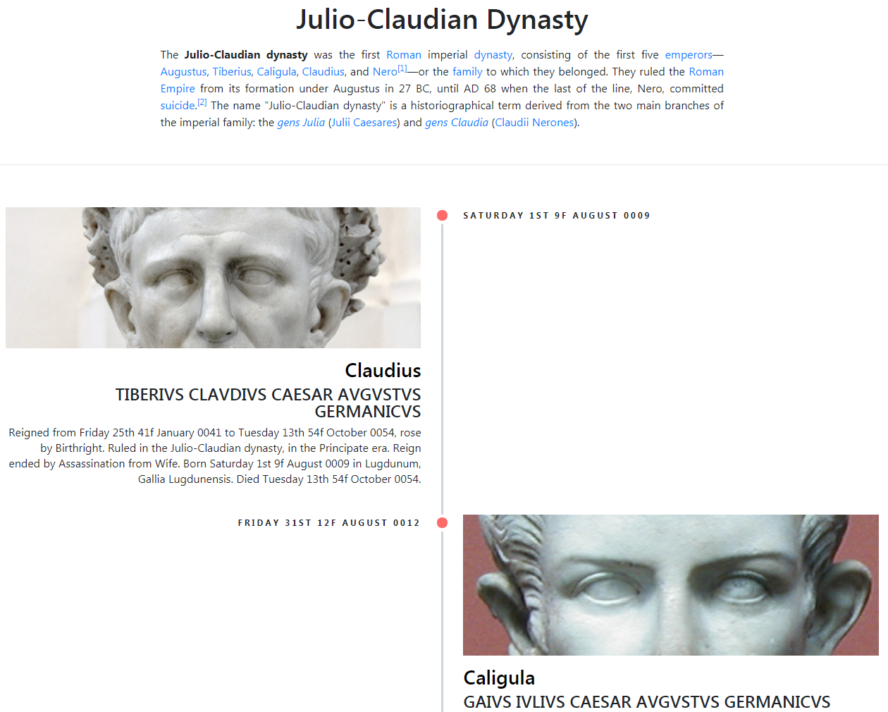
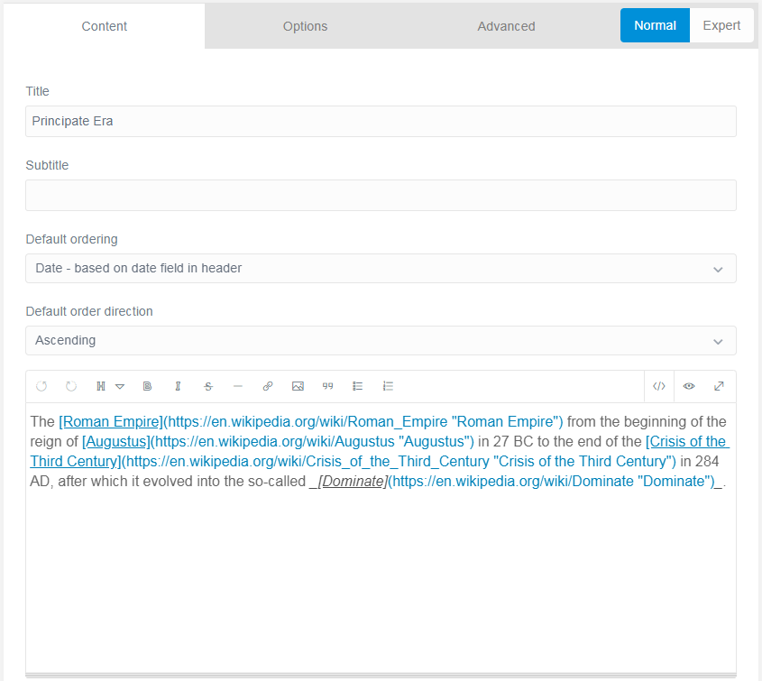
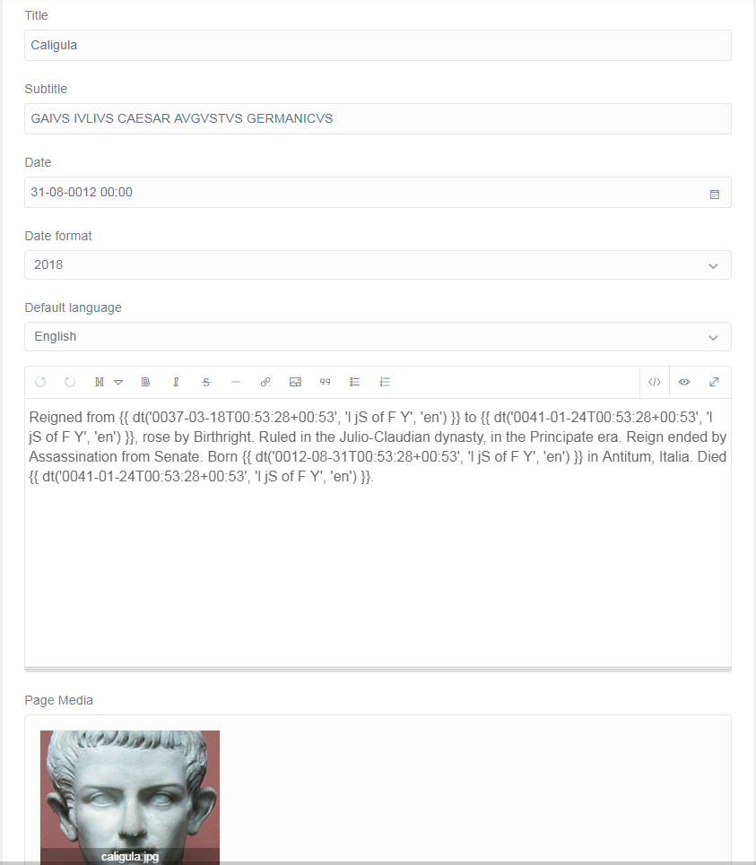

# Timeline Plugin



## Description

The **Timeline**-plugin is for [Grav CMS](http://github.com/getgrav/grav), and lets you create and manage timelines in an ordered, hierarchical fashion. Timelines can be nested within each other, minutely customized on a page-level, and further customized with your own templates and styles. A [demo is available](https://olevik.me/staging/grav-skeleton-project-space), and demo content can be found in [/pages](https://github.com/OleVik/grav-skeleton-timeline/tree/master/pages).

## Installation

Installing the Timeline-plugin can be done in one of two ways. The GPM (Grav Package Manager) installation method enables you to quickly and easily install the plugin with a simple terminal command, while the manual method enables you to do so via a zip file.

**Note:** The [intl](http://php.net/manual/en/book.intl.php)-extension for PHP must be [installed and enabled](http://php.net/manual/en/intl.installation.php "See especially User Contributed Notes") to use this plugin.

### GPM Installation (Preferred)

The simplest way to install this plugin is via the [Grav Package Manager (GPM)](http://learn.getgrav.org/advanced/grav-gpm) through your system's terminal (also called the command line). From the root of your Grav install type:

    bin/gpm install timeline

This will install the Timeline-plugin into your `/user/plugins` directory within Grav. Its files can be found under `/your/site/grav/user/plugins/timeline`.

### Manual Installation

To install this plugin, just download the zip version of this repository and unzip it under `/your/site/grav/user/plugins`. Then, rename the folder to `timeline`. You can find these files on [GitHub](https://github.com/ole-vik/grav-plugin-timeline) or via [GetGrav.org](http://getgrav.org/downloads/plugins#extras).

You should now have all the plugin files under

    /your/site/grav/user/plugins/timeline
	
> NOTE: This plugin is a modular component for Grav which requires [Grav](http://github.com/getgrav/grav) and the [Error](https://github.com/getgrav/grav-plugin-error) and [Problems](https://github.com/getgrav/grav-plugin-problems) to operate.

## Configuration

Before configuring this plugin, you should copy the `user/plugins/timeline/timeline.yaml` to `user/config/plugins/timeline.yaml` and only edit that copy.

Here is the default configuration and an explanation of available options:

```yaml
enabled: true
language: en
order:
  by: date
  dir: asc
cache: native
truncate: 100
```

### Settings and Usage

| Variable | Default | Options | Note |
|----------|---------|-------------------------------------------------|--------------------------------------------------------------------------------------------|
| enabled | true | `true` or `false` | Enables or disables the plugin. |
| language | en | string (2) | Any two-letter (ISO-639-1) language code. |
| order: |  |  |  |
|   by | date | `date`, `title`, or `folder` | Orders pages according to date, title, or folder-name. |
|   dir | asc | `asc` or `desc` | Order pages ascending or descending. |
| cache | native | `native`, `persist`, `transient`, or `disabled` | Where to store plugin's internal data. |
| truncate | 100 | int or boolean | Limits the amount of words in each note, to an integer or boolean state for default (100). |

Each timeline is structured with a Header (`timeline.md`, Timeline-template) and Events (`timeline_event.md`, Timeline Event-template). Headers are used as separators and can order their descendant Events, as well as contain normal fields such as `title`, `subtitle`, and `content`. Events also render a formatted, localized `date` (using [`date_format`](http://php.net/manual/en/function.date.php) and `locale`), as well as an `image`. In addition, Events are cast as Linked Data with [JSON-LD](https://json-ld.org/), wherein `type`, `place`, `locality`, and `region` are used.

Sound confusing? It's much easier to do all this from the [Admin](https://github.com/getgrav/grav-plugin-admin)-plugin:

#### Header Page



#### Event Page



#### Event Options


